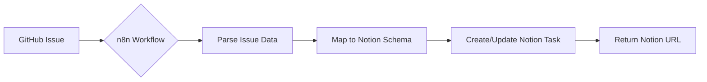
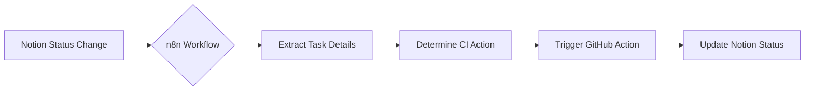
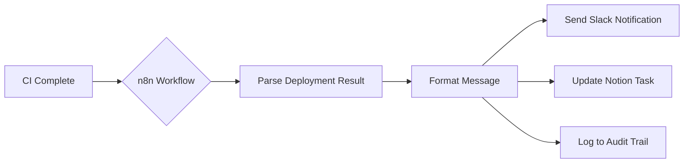
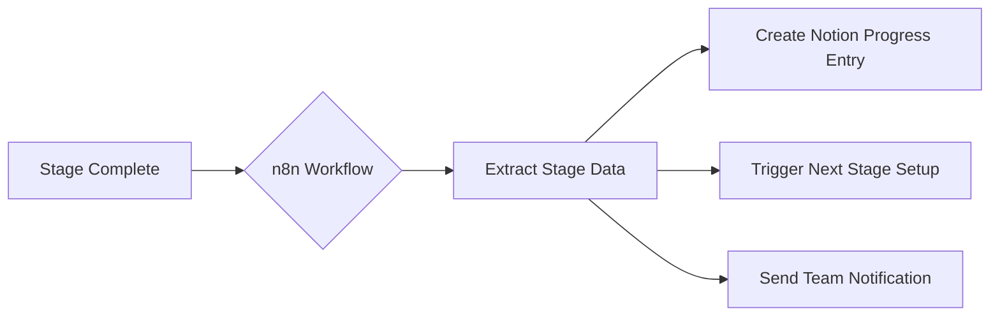

# n8n Workflow Automation Design

## Overview

This document outlines the n8n workflow automation architecture for ResearchFlow, enabling seamless integration between GitHub, Notion, CI/CD, and the ResearchFlow application.

## MCP Server Integration

```
URL: https://loganglosser13.app.n8n.cloud/mcp-server/http
Auth: Bearer token (stored in N8N_MCP_TOKEN)
```

## Workflow Catalog

### 1. GitHub → Notion Task Sync

**Trigger**: GitHub Issue Created/Updated
**Endpoint**: `POST /api/n8n/webhook/github-sync`



**Field Mapping**:
| GitHub Field | Notion Property |
|--------------|-----------------|
| issue.title | Task |
| issue.labels | Category (select) |
| issue.assignee | Assignee |
| issue.state | Status |
| issue.body | Description |

### 2. Notion → CI/CD Trigger

**Trigger**: Notion Task Status = "Queue CI"
**Endpoint**: `POST /api/n8n/webhook/ci-trigger`



**CI Actions**:
- `ci_smoke` → Run smoke tests
- `ci_full` → Full test suite
- `deploy_staging` → Deploy to staging
- `deploy_prod` → Deploy to production

### 3. Deployment Notification

**Trigger**: GitHub Actions Workflow Complete
**Endpoint**: `POST /api/n8n/webhook/deployment-notify`



### 4. Workflow Stage Completion Sync

**Trigger**: ResearchFlow Stage Marked Complete
**Endpoint**: `POST /api/n8n/webhook/stage-completion`



## API Endpoint Reference

### Webhooks (Receive from n8n)

| Endpoint | Method | Purpose |
|----------|--------|---------|
| `/api/n8n/webhook/github-sync` | POST | Receive GitHub sync results |
| `/api/n8n/webhook/notion-update` | POST | Receive Notion task updates |
| `/api/n8n/webhook/ci-complete` | POST | Receive CI completion events |
| `/api/n8n/webhook/stage-completion` | POST | Receive stage sync confirmations |

### Triggers (Send to n8n)

| Endpoint | Method | Purpose |
|----------|--------|---------|
| `/api/n8n/trigger/github-notion-sync` | POST | Sync issue to Notion |
| `/api/n8n/trigger/notion-ci-trigger` | POST | Trigger CI from Notion |
| `/api/n8n/trigger/deployment-notify` | POST | Send deployment notification |
| `/api/n8n/trigger/stage-completion` | POST | Sync stage completion |

### Status

| Endpoint | Method | Purpose |
|----------|--------|---------|
| `/api/n8n/status` | GET | Check n8n integration status |

## Implementation Phases

### Phase 1: Core Integration (Current)
- [x] n8n client library created
- [x] Environment variables configured
- [x] Webhook routes implemented
- [x] Trigger routes implemented
- [ ] n8n workflows created in cloud console

### Phase 2: GitHub Sync
- [ ] Create GitHub webhook in repo
- [ ] Create n8n workflow for issue → Notion
- [ ] Test bidirectional sync
- [ ] Add PR comment sync

### Phase 3: CI/CD Automation
- [ ] Connect Notion status changes to n8n
- [ ] Create GitHub Actions trigger workflow
- [ ] Implement deployment notifications
- [ ] Add rollback triggers

### Phase 4: Research Workflow Sync
- [ ] Connect stage completion events
- [ ] Create progress dashboard updates
- [ ] Add audit trail logging
- [ ] Implement team notifications

## Security Considerations

1. **Token Security**: All tokens stored in environment variables
2. **Webhook Validation**: Verify request sources via signatures
3. **Rate Limiting**: Implement throttling on trigger endpoints
4. **Audit Logging**: Log all n8n interactions for compliance

## Monitoring

- n8n execution dashboard: `https://loganglosser13.app.n8n.cloud/executions`
- Failed workflow alerts via Slack
- Notion database for execution logs

## Next Steps

1. Log into n8n cloud console
2. Create workflows following the above designs
3. Test each workflow individually
4. Connect workflows for full automation chain
5. Monitor and iterate based on usage patterns
